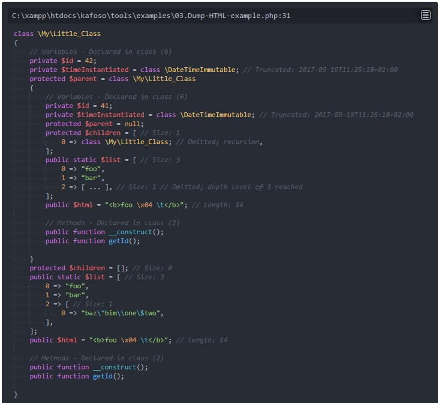

Various generic PHP tools.

Will be expanded as necessary.

# Kafoso\Tools\Debug\Dumper

An improved yet different version of PHP's fundamental `var_dump` method. The presentation is more in par with that of the appearance of PHP classes adhering to [PSR-1](http://www.php-fig.org/psr/psr-1/) and [PSR-2](http://www.php-fig.org/psr/psr-2/). However, for readability reasons, and to save precious space and thus prevent vertigo<sup><a href="#footnotes-vertigo">1</a></sup>, an indentation of 2 space characters is used, [rather than 4](http://www.php-fig.org/psr/psr-2/#2-4-indenting).

Handles recursion gracefully and limits the depth (default: 3) of objects and arrays, omitting content going beyond the maximum desired depth.

Especially useful for dumping very large objects and arrays containing redundant or recursive information. E.g. database contents, which have been mapped to PHP classes with (sometimes) complex relations. Said mapping may be performed through PDO, mysqli, Doctrine, and other DBAL or ORM tools.

## Example output

A simple class, with an id, a parent/child relationship, and a static variable `$list`.

- **Fully quantified class names and SPL hashes**<br>
Each class gets printed with its unique SPL hash identifier. Useful to find recursion, which incidentally is denoted by `*RECURSION*`.
- **\*RECURSION\***<br>
Notice that the Object instance `000000005e85475000007fd972cdb06b` under the parent is not reprinted, as it is the same as the very first class.
- **(Array value omitted)**<br>
Notice how the `$list` variable is visually different between the two classes? While they are indeed identical, the dumper has reached its maximum depth level, and thus the a portion of the parent's `$list` variable is omitted. An `(Object value omitted)` equivalent exists for Objects.

Try it: `php examples/DebugDumperExample.php`

### As plain text

The following is produced using `Kafoso\Tools\Debug\Dumper::dump($myLittleClass)`, which presents the contents as plain text (using the `Kafoso\Tools\Debug\Dumper\PlainTextFormatter`).

```
My\Little_Class Object #
{
  private $id = int(42);
  protected $parent = My\Little_Class Object #
  {
    private $id = int(41);
    protected $parent = NULL;
    protected $children = array(1) {
      [0] => My\Little_Class Object #
      {
        *RECURSION*
      },
    }
    public static $list = array(3) {
      [0] => string(3) "foo",
      [1] => string(3) "bar",
      [2] => array(1) {
        (Array value omitted)
      }
    }
  }
  protected $children = array(0) {
  }
  public static $list = array(3) {
    [0] => string(3) "foo",
    [1] => string(3) "bar",
    [2] => array(1) {
      [0] => string(3) "baz"
    }
  }
}
```

### As JSON

The same input as the previous plain text example, but this time using `Kafoso\Tools\Debug\Dumper::dumpJson($myLittleClass)`.

`JSON_PRETTY_PRINT` is on by default, as this is intended for debugging purposes, but may be disabled if desired. E.g. when retrieving JSON through XHR from Javascript where indentations do not matter.

The JSON view contains less information compared to plain text. For instance, there is no class variable exposure information (`static`, `public`, `protected`, `private`); however, the class variable names and values do appear. Additionally, the following object keys are invasive and change the structure of the resulting Javascript objects.

- `Kafoso\\Tools\\Debug\\Dumper|CLASS`
- `Kafoso\\Tools\\Debug\\Dumper|RECURSION`
- `Kafoso\\Tools\\Debug\\Dumper|ARRAY_VALUE_OMITTED`
- `Kafoso\\Tools\\Debug\\Dumper|OBJECT_VALUE_OMITTED`

However, the `Dumper` is for debugging purposes, after all, and should be used as such.

```json
{
    "Kafoso\\Tools\\Debug\\Dumper|CLASS": "My\\Little_Class Object #",
    "id": 42,
    "parent": {
        "Kafoso\\Tools\\Debug\\Dumper|CLASS": "My\\Little_Class Object #",
        "id": 41,
        "parent": null,
        "children": [
            {
                "Kafoso\\Tools\\Debug\\Dumper|CLASS": "My\\Little_Class Object #",
                "Kafoso\\Tools\\Debug\\Dumper|RECURSION": "*RECURSION*"
            }
        ],
        "list": [
            "foo",
            "bar",
            {
                "Kafoso\\Tools\\Debug\\Dumper|ARRAY_VALUE_OMITTED": "(Array value omitted; array(1))"
            }
        ]
    },
    "children": [],
    "list": [
        "foo",
        "bar",
        [
            "baz"
        ]
    ]
}
```

### As HTML

Usage:

```php
<?php
Kafoso\Tools\Debug\Dumper::dumpHtml($myLittleClass)
```

The HTML dumper is great for showing variables in a nice, highlighted fashion.

Classes are displayed as psudo-objects with interfaces to inheritance, traits, constants, variables, and methods; "pseudo-object" means the values are displayed with a snapshot of what the object currently contains.

Various options exist, which are stored in a cookie.

Options for showing and hiding sections include:

- Extended parent classes.
- Interfaces.
- Traits.
- Constants.
- Class variables.
- Methods.
- Method arguments.
- Method argument type hints.

One option, "Truncate generic objects", allows you to display objects like `\DateTime` as a string, providing a better overview and saving valuable space.

Do notice, that a maximum depth restriction is enforced, which by default is 3. This number can be changed by passing it as the 2nd variable, e.g.:

```php
<?php
Kafoso\Tools\Debug\Dumper::dumpHtml($myLittleClass, 10)
```

This behavior is identical to the plain text and JSON rendering methods.

**Sample output:**



The theme, "dark-one-ui", is courtesy of the [Atom Editor](https://atom.io/).

# Footnotes

<a name="footnotes-vertigo"></a>
<sup>1</sup> **Vertigo**: Massive nested indentations in code, usually produced by nested conditions and loops, resulting in lowered readability.
